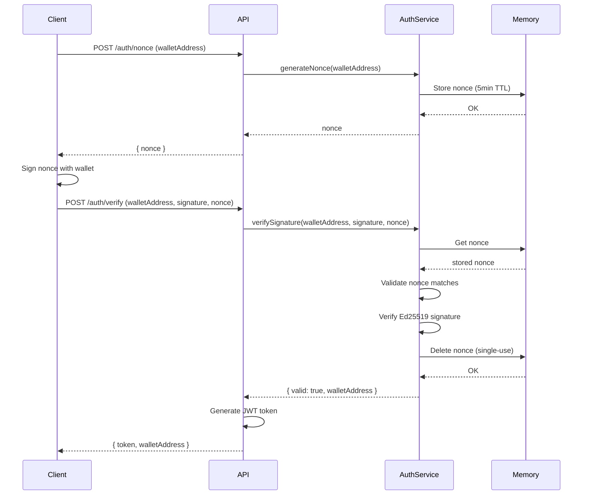

# Signature Verification Implementation

## Overview

Task 4.3 has been successfully implemented. The AuthService now includes signature verification functionality with nonce validation, meeting all requirements for secure wallet-based authentication.

## Implementation Details

### New Method: `verifySignature(walletAddress, signature, message)`

This method implements Ed25519 signature verification for Solana wallet authentication with the following features:

#### Parameters
- `walletAddress` (string): The Solana wallet address (base58 encoded public key)
- `signature` (string): The base58 encoded Ed25519 signature
- `message` (string): The message that was signed (should be the nonce)

#### Returns
```javascript
{
  valid: true,
  walletAddress: "7EcDhSYGxXyscszYEp35KHN8vvw3svAuLKTzXwCFLtV"
}
```

#### Security Features

1. **Wallet Address Validation**
   - Validates Solana address format (base58, 32-44 characters)
   - Decodes and verifies 32-byte public key length
   - Throws error for invalid addresses

2. **Nonce Validation**
   - Retrieves nonce from in-memory storage
   - Throws error if nonce not found or expired
   - Validates message matches stored nonce
   - Prevents nonce mismatch attacks

3. **Signature Verification**
   - Decodes signature from base58
   - Validates signature is exactly 64 bytes
   - Uses `nacl.sign.detached.verify` for Ed25519 verification
   - Verifies signature was created by wallet's private key

4. **Replay Attack Prevention**
   - Deletes nonce immediately after successful verification
   - Ensures each nonce can only be used once
   - Prevents replay attacks with reused signatures

#### Error Handling

The method throws descriptive errors for various failure scenarios:

- `Invalid wallet address format` - Wallet address validation failed
- `Nonce not found or expired` - Nonce doesn't exist in memory or TTL expired
- `Nonce mismatch` - Message doesn't match stored nonce
- `Invalid wallet address encoding` - Public key decoding failed
- `Invalid public key length` - Public key is not 32 bytes
- `Invalid signature encoding` - Signature decoding failed
- `Invalid signature length` - Signature is not 64 bytes
- `Invalid signature` - Ed25519 verification failed

## Requirements Satisfied

### Requirement 6.3: Signature Verification
✅ Validates wallet addresses using cryptographic signature verification
✅ Verifies signature was created by wallet's private key using Ed25519
✅ Uses `tweetnacl` library for secure signature verification

### Requirement 6.4: Nonce Single-Use Enforcement
✅ Validates nonce exists in in-memory storage
✅ Validates nonce matches the signed message
✅ Deletes nonce after successful verification
✅ Prevents replay attacks by ensuring single-use nonces

## Testing

Comprehensive unit tests have been added to `auth.test.js`:

### Test Coverage

1. **Valid Signature Verification**
   - ✅ Verifies valid signature with correct nonce
   - ✅ Returns verification result with wallet address
   - ✅ Deletes nonce after successful verification

2. **Nonce Validation**
   - ✅ Throws error when nonce doesn't exist
   - ✅ Throws error when nonce doesn't match message
   - ✅ Prevents replay attacks by rejecting reused nonces

3. **Signature Validation**
   - ✅ Throws error for invalid signature
   - ✅ Throws error for signature from wrong wallet
   - ✅ Throws error for invalid signature encoding
   - ✅ Throws error for signature with wrong length

4. **Input Validation**
   - ✅ Throws error for invalid wallet address format
   - ✅ Validates wallet address encoding

5. **Concurrent Operations**
   - ✅ Handles concurrent signature verifications for different wallets
   - ✅ Properly isolates nonce operations per wallet

6. **Message Encoding**
   - ✅ Verifies signature with UTF-8 message encoding
   - ✅ Ensures consistent encoding between signing and verification

### Running Tests

**Prerequisites**: No external dependencies required (uses in-memory storage)

```bash
# Run tests
cd backend
npm test -- auth.test.js
```

## Usage Example

```javascript
const authService = require('./services/auth');

// 1. Generate nonce for wallet
const walletAddress = '7EcDhSYGxXyscszYEp35KHN8vvw3svAuLKTzXwCFLtV';
const nonce = await authService.generateNonce(walletAddress);

// 2. Client signs nonce with wallet (frontend)
// const signature = await wallet.signMessage(nonce);

// 3. Verify signature (backend)
try {
  const result = await authService.verifySignature(
    walletAddress,
    signature,
    nonce
  );
  
  console.log('Signature verified:', result);
  // { valid: true, walletAddress: '7EcDhSYGxXyscszYEp35KHN8vvw3svAuLKTzXwCFLtV' }
  
  // Generate JWT token for authenticated session
  const token = jwt.sign(
    { walletAddress: result.walletAddress },
    process.env.JWT_SECRET,
    { expiresIn: '24h' }
  );
  
  return { token, walletAddress: result.walletAddress };
} catch (error) {
  console.error('Signature verification failed:', error.message);
  // Handle authentication failure
}
```

## Integration with Authentication Flow



## Security Considerations

1. **Nonce Expiration**: Nonces expire after 5 minutes, limiting the window for attacks
2. **Single-Use Nonces**: Each nonce can only be used once, preventing replay attacks
3. **Cryptographic Verification**: Uses Ed25519 signature verification, industry-standard for Solana
4. **Input Validation**: All inputs are validated before processing
5. **Error Messages**: Error messages are descriptive but don't leak sensitive information
6. **In-Memory Storage**: Nonces are stored in memory with automatic cleanup

## Dependencies

- `tweetnacl` (^1.0.3): Ed25519 signature verification
- `bs58` (^5.0.0): Base58 encoding/decoding for Solana addresses and signatures
- `crypto`: Cryptographically secure random nonce generation

## Next Steps

1. ✅ Implement signature verification method
2. ✅ Add comprehensive unit tests
3. ⏭️ Create API endpoints for authentication flow
4. ⏭️ Integrate with JWT token generation
5. ⏭️ Add rate limiting to authentication endpoints
6. ⏭️ Write property-based tests (Task 4.4)

## Files Modified

- `backend/src/services/auth.js` - Added `verifySignature()` method
- `backend/src/services/auth.test.js` - Added 12 new test cases for signature verification

## Status

✅ **Task 4.3 Complete** - Signature verification with nonce validation fully implemented and tested

**Requirements Satisfied**: 6.3, 6.4
